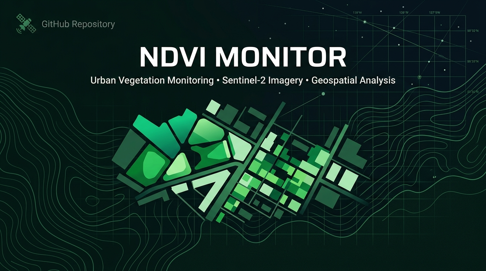

# NDVI Monitor

<p align="center">
  
</p>

<p align="center">
  <a href="https://www.python.org/downloads/"></a>
  <a href="LICENSE"></a>
  
  
  
</p>

<p align="center">
  <b>Sentinel-2 based GIS toolkit for automated NDVI analysis, urban vegetation monitoring, and spatial forecasting.</b>
</p>

<p align="center">
  <a href="README.md">Русский</a> | <b>English</b>
</p>

---

## Project Status

**Active Development**

The project was developed as part of a GIS research workflow (academic diploma) and is actively maintained as an open-source geospatial analysis tool for environmental and urban green infrastructure assessment.

---

## Key Features

- **Automated NDVI Calculation**: Support for Sentinel-2 raw optical bands (`B04` / `B08`) and pre-calculated NDVI rasters (Float32 & Int16 $\times$ 10000).
- **Explicit Raster Alignment & Reprojection**: Target grid snapping (`EPSG:32636`, 10 m resolution) and boundary vector clipping (`.gpkg`, `.shp`, `.geojson`).
- **Common Validity Masking**: Strict intersection of multi-temporal valid data masks (`valid2015 AND valid2025`).
- **Vegetation & Change Classification**: Stratification of canopy condition into 5 categorical stages and Delta NDVI change detection.
- **Data-Driven Spatial Forecasting**: CA-Markov transition matrices combined with polygon clustering and adaptive distance-decay influence surfaces for scenario simulation.
- **Cartographic-Grade Visualizations**: Standalone high-resolution maps (300 DPI, North arrow, scale bars, percentile-based robust stretch).
- **Automated Enterprise Reporting**: Instant generation of structured Excel summaries (`.xlsx`) and formal analytical reports in Word (`.docx`).
- **Desktop GUI & CLI Modes**: Easy-to-use Tkinter interface alongside an automated CLI pipeline.

---

## Workflow Architecture

```text
       Sentinel-2 Bands / Pre-computed NDVI
                         │
                         ▼
                   [1. Loader]
            (Metadata & CRS Validation)
                         │
                         ▼
                [2. Raster Align]
        (Reprojection, Snap-to-Grid, Crop)
                         │
                         ▼
             [3. NDVI & Common Mask]
        (NIR-RED / NIR+RED & Temporal Mask)
                         │
                         ▼
               [4. Classification]
        (5-Class Vegetation Canopy Tiers)
                         │
                         ▼
              [5. Change Detection]
        (Delta NDVI & Polygonization)
                         │
                         ▼
                [6. Statistics]
       (Transition Matrix & Area Accounting)
                         │
                         ▼
                 [7. Forecasting]
        (Markov Quotas & Spatial Influence)
                         │
                         ▼
              [8. Reports & Visuals]
        (GeoTIFF, PNG Maps, Excel, Word)
```

---

## Tech Stack

| Category | Libraries / Tools |
| :--- | :--- |
| **GIS & Geodata** | `rasterio`, `geopandas`, `shapely`, `pyproj`, `pyogrio` |
| **Data Processing & ML** | `numpy`, `pandas`, `scipy` |
| **Visuals & Cartography**| `matplotlib` |
| **Report Automation** | `openpyxl`, `python-docx` |
| **UI & CLI** | `tkinter`, `argparse`, `tqdm` |

---

## Case Study

**Study Area**: Primorsky District, Saint Petersburg

- **Area**: 109.87 km²
- **Population**: ~715,000 residents
- **Observation Period**: 2015 – 2025 (Forecast to 2035)
- **Data Source**: Sentinel-2 (L2A Bottom-Of-Atmosphere reflectance)
- **Target Spatial Resolution**: 10 m / pixel

### Typical Vegetation Class Distribution

| Class ID | NDVI Range | Description | Typical Land Cover |
| :---: | :---: | :--- | :--- |
| **1** | $< 0.10$ | Водные объекты и открытый грунт | Water bodies, quarries, bare soil |
| **2** | $0.10 - 0.25$ | Искусственные покрытия / застройка | Impervious surfaces, dense urban built-up |
| **3** | $0.25 - 0.45$ | Разреженная / нарушенная растительность | Sparse lawns, disturbed soil, ruderal vegetation |
| **4** | $0.45 - 0.65$ | Умеренная растительность | Urban parks, residential greenery, shrubs |
| **5** | $> 0.65$ | Плотный здоровый древостой | Dense forest tracts, protected conservation areas |

---

## Quick Start

### Installation

```bash
git clone https://github.com/MOneK292/NDVI_monitor.git
cd NDVI_monitor
python -m venv .venv
.venv\Scripts\activate       # Windows
# source .venv/bin/activate  # Linux / macOS
pip install -r requirements.txt
```

*Requirements: Python 3.12 (64-bit recommended).*

### Running the Pipeline

**1. Graphical Interface (GUI):**
```bash
python main.py --gui
```

**2. CLI Pipeline:**
```bash
python main.py --input ./input
```

**3. Acceptance Verification Test:**
```bash
python verify_pipeline.py
```

---

## Input Data Layout

Place input files into the `input/` folder:

- **1 Vector boundary**: `*.gpkg`, `*.shp`, or `*.geojson` (sample included: `input/Primorsky.gpkg`).
- **Sentinel-2 Bands (Option 1)**:
  - `B04_2015.tif`, `B08_2015.tif`
  - `B04_2025.tif`, `B08_2025.tif`
- **Or Pre-calculated NDVI (Option 2)**:
  - `ndvi2015.tif`, `ndvi2025.tif`

---

## Output Structure

All outputs are saved to `output/`:
- `output/rasters/` — GeoTIFFs (aligned NDVI, valid mask, delta NDVI, forecast, and `change_polygons.gpkg`).
- `output/figures/` — High-resolution 300 DPI publication-ready PNG maps and charts.
- `output/tables/` — Excel summary reports, transition matrices, and largest change rankings.
- `output/reports/` — Formal Word report (`ndvi_monitor_report.docx`).

---

## License

This project is open source and available under the terms of the [MIT License](LICENSE).
